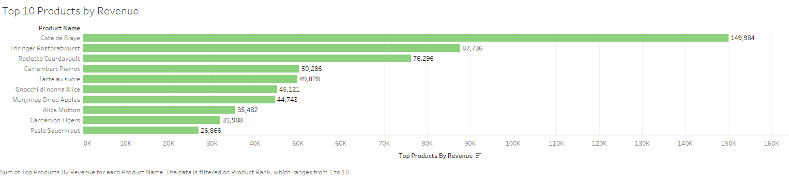
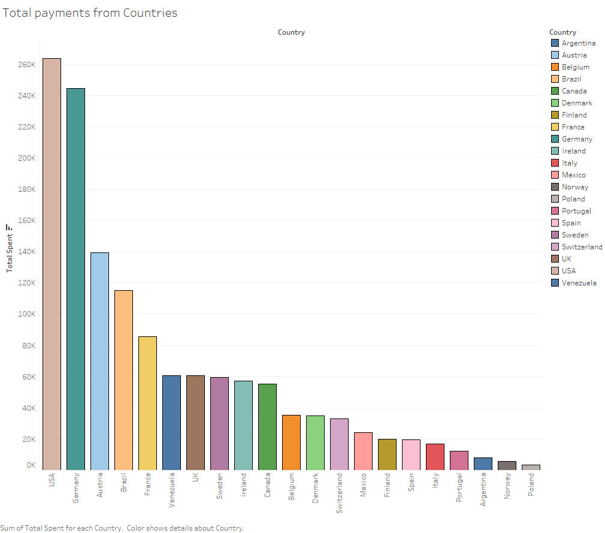
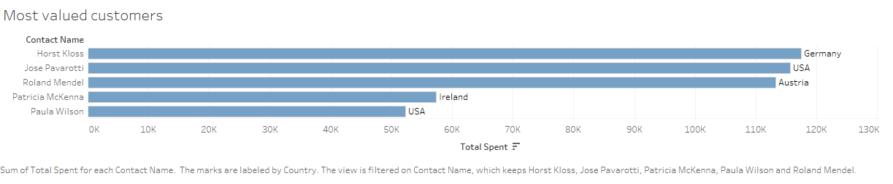

# Northwind Traders Analytics Case Study
## Project Summary

This project explores the Northwind Traders dataset to extract important business insights using SQL.
The goal is to analyze sales trends, identify top performing products alongside their categories.
Another aim is to evaluate employee performance, and examine shipping and supply efficiency.
This case study simulates real-world analytics tasks and provides data-driven recommendations for decision making and to improve operations.

## Objectives

- What are the top-selling products and categories by revenue?

- Which customers generate the most value?

- How do sales vary over time?

- Which employees contribute the most to sales?

- How efficient are the shipping methods?

- Are there patterns or concerns in inventory or supplier management?

## Dataset Introduction and Description

The dataset simulates a small business's operations and includes information on customers, orders, products, employees, suppliers, and shipping methods.

Key tables:

- Orders: Sales transactions

- OrderDetails: Line items for each order

- Customers: Info about buyers

- Employees: Sales representatives

- Products: Product catalogue and stock

- Categories: Product category info

- Suppliers: Who provides the products

- Shippers: Shipping companies

## Tools used

- MySQL/SQLite
- Tableau

## Analysis Section
### Top-selling products and categories by revenue
The product 'Côte de Blaye' generated the highest revenue, significantly outperforming all others. This could be a result of high unit price, high volume, or both. Something worth investigating further.
The Top 3 best performing products ('Côte de Blaye', 'Thüringer Rostbratwurst', and 'Raclette Courdavault') contributing to over 23% of the total sales. 
Strategic marketing around these high-performers could significantly boost overall sales. Additionally, these products span different categories, suggesting diverse customer preferences.

🔗 [SQL code for Q1](./sql/question_1_top_products.sql)

Here's a visualisation of the top-selling products from the Northwind Dataset:

### Customers generating the most value
Investigating costumer spending patterns can tailor the business' approach targeting specific regions. 
The graph below shows the total revenue per country, with the top five being the USA, Germany, Austria, Brazil, and France:

To dive deeper, we explored individual customers to determine whether these high-revenue countries are supported by a large number of small purchases or a few major contributors:

Using the SQL scipt linked below, we calculated whether the top countries are consist of multiple smaller sales, or each has a few, but very big spenders that evidently boosting the sales for that region.

🔗 [SQL code for Q2](./sql/question_2_top_spenders.sql)

Key findings include:

- USA: Jose Pavarotti accounts for 43.89% of all US sales

- Germany: Horst Kloss generates 48.02% of the country’s sales

- Austria: Roland Mendel alone makes up 81.18% of Austria’s total revenue

These insights show how a handful of customers can disproportionately influence regional performance, which opens up opportunities for personalised marketing, premium offers, or even VIP programs.

## Sales Trend over Time

Investigating how sales varies over time can give us meaningful insights.
The following interactive dashboard showcases monthly sales trends by product category and shipping country, based on Northwind’s transactional data. 
I used SQL for data transformation and Tableau for visualization, including dynamic tooltips, trend analysis, and filtering options to support decision-making.
Preview:

Download the Tableau Workbook: [Book1.twb](./Book1.twb)

🔗 [SQL code for Q2](./sql/question_3_sales_over_time.sql)

