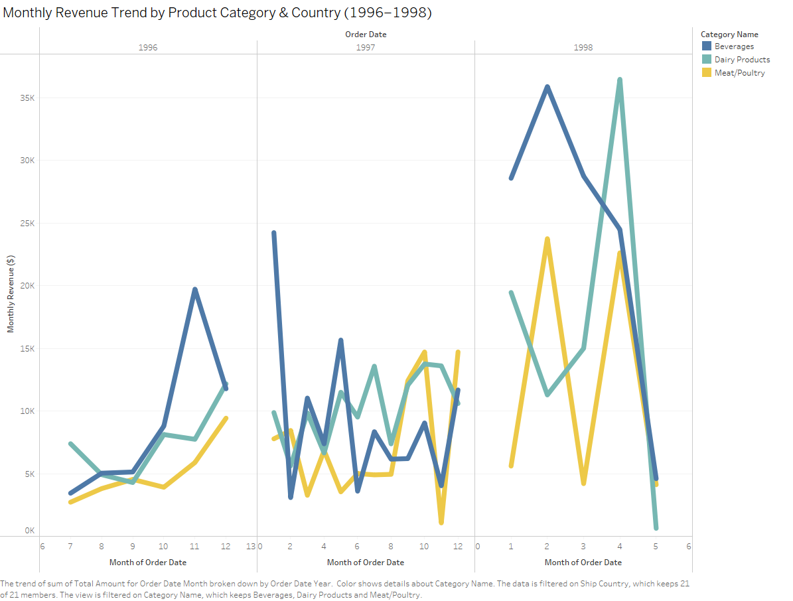

# Northwind Traders Analytics Case Study
## Project Summary

This project explores the Northwind Traders dataset to extract important business insights using SQL.
The goal is to analyze sales trends, identify top performing products alongside their categories.
Another aim is to evaluate employee performance, and examine shipping and supply efficiency.
This case study simulates real-world analytics tasks and provides data-driven recommendations for decision making and to improve operations.

## Objectives

- What are the top-selling products and categories by revenue?

- Which customers generate the most value?

- How do sales vary over time?

- Which employees contribute the most to sales?

- How efficient are the shipping methods?

- Are there patterns or concerns in inventory or supplier management?

## Dataset Introduction and Description

The dataset simulates a small business's operations and includes information on customers, orders, products, employees, suppliers, and shipping methods.

Key tables:

- Orders: Sales transactions

- OrderDetails: Line items for each order

- Customers: Info about buyers

- Employees: Sales representatives

- Products: Product catalogue and stock

- Categories: Product category info

- Suppliers: Who provides the products

- Shippers: Shipping companies

## Tools used

- MySQL/SQLite
- Tableau

## Analysis Section
### Top-selling products and categories by revenue
The product 'Côte de Blaye' generated the highest revenue, significantly outperforming all others. This could be a result of high unit price, high volume, or both. Something worth investigating further.
The Top 3 best performing products ('Côte de Blaye', 'Thüringer Rostbratwurst', and 'Raclette Courdavault') contributing to over 23% of the total sales. 
Strategic marketing around these high-performers could significantly boost overall sales. Additionally, these products span different categories, suggesting diverse customer preferences.

🔗 [SQL code for Q1](./sql/question_1_top_products.sql)

Here's a visualisation of the top-selling products from the Northwind Dataset:

### Customers generating the most value
Investigating costumer spending patterns can tailor the business' approach targeting specific regions. 
The graph below shows the total revenue per country, with the top five being the USA, Germany, Austria, Brazil, and France:

To dive deeper, we explored individual customers to determine whether these high-revenue countries are supported by a large number of small purchases or a few major contributors:

Using the SQL scipt linked below, we calculated whether the top countries are consist of multiple smaller sales, or each has a few, but very big spenders that evidently boosting the sales for that region.

🔗 [SQL code for Q2](./sql/question_2_top_spenders.sql)

Key findings include:

- USA: Jose Pavarotti accounts for 43.89% of all US sales

- Germany: Horst Kloss generates 48.02% of the country’s sales

- Austria: Roland Mendel alone makes up 81.18% of Austria’s total revenue

These insights show how a handful of customers can disproportionately influence regional performance, which opens up opportunities for personalised marketing, premium offers, or even VIP programs.

## Sales Trend over Time

Investigating how sales varies over time can give us meaningful insights.

The following interactive dashboard showcases monthly sales trends by product category and shipping country, based on Northwind’s transactional data. 

I used SQL for data transformation and Tableau for visualization, including dynamic tooltips, trend analysis, and filtering options to support decision-making.

Preview:

Download the Tableau Workbook: [Book1.twb](./Book1.twb)

🔗 [SQL code for Q3](./sql/question_3_sales_over_time.sql)

## Most Valuable Employees

In this section, we are finding which of our employees are generating the biggest revenue, and also how many orders they have succesfully completed.

The following table ranks employees based on their **total sales revenue** and **order volume**, identifying the company's top performers. 

| Rank | Employee Name         | Total Orders | Total Sales ($) |
|------|-----------------------|--------------|-----------------|
| 1    | Mrs. Margaret Peacock| 156          | 250,187.45      |
| 2    | Ms. Janet Leverling  | 127          | 213,051.30      |
| 3    | Ms. Nancy Davolio    | 123          | 202,143.71      |
| 4    | Dr. Andrew Fuller    | 96           | 177,749.26      |
| 5    | Mr. Robert King      | 72           | 141,295.99      |
| 6    | Ms. Laura Callahan   | 104          | 133,301.03      |
| 7    | Ms. Anne Dodsworth   | 43           | 82,964.00       |
| 8    | Mr. Michael Suyama   | 67           | 78,198.10       |
| 9    | Mr. Steven Buchanan  | 42           | 75,567.75       |

As a mentionable insight, the average total sales across all employees is **150,495.4 ($)** and **92** total orders have been completed.

### Deeper Insights & Future Exploration

While revenue and order volume paint a strong initial picture of employee performance, there's more beneath the surface:

- **Order Fulfilment Time:**  
  Investigating the time between `OrderDate` and `ShippedDate` for each employee can reveal how quickly they manage to push orders through the pipeline.

  An employee handling mostly local orders may show higher order counts due to faster turnover, not necessarily better performance.

- **Geographic Bias:**  
  Since shipping times vary based on destination, employees assigned to different regions may appear slower or faster than others — this could skew their metrics.

- **Tenure vs Performance:**  
  By comparing each employee’s total sales to their hire date, we can calculate average monthly or yearly revenue per employee. This helps separate high-performing newcomers from long-serving steady earners.

🔗 [SQL code for Q4](./sql/question_4_employee_performance.sql)

## Shipping Performance and Order Completion Audit

I analysed order fulfillment times using the Northwind dataset to identify operational inefficiencies, late deliveries, and potential shipping issues. 

This involved calculating average delivery durations, identifying outliers, and investigating unshipped orders and discontinued products.

This project includes two SQL files: one focusing on high-level order delivery performance, and the other zooming into product-level shipment status.

The first script provides insights into average delivery times, unshipped orders, and shipper performance. 

🔗 [SQL code for Q5](./sql/question_5_shipping_performance_01.sql)

The second script investigates individual product line items - particularly those involving discontinued products - to identify fulfillment risks or policy issues.

🔗 [SQL code for Q5](./sql/question_5_shipping_performance_02.sql)

### Key insights:

Based on 809 orders, the average delivery time is 8.5 days. 

21 orders (2.5%) have NULL shipping dates, despite all address and order details being present:
  - 14 products are still in production, likely still in the fulfillment pipeline.
  - 7 discontinued products — needs investigation: were they discontinued before or after the order was placed?

Shipping performance is consistent across providers:

- United Package: 114 shipments

- Speedy Express: 80 shipments

- Federal Shipping: 71 shipments

No statistically significant delays associated with any specific shipper.

It is recommended to further investigate whether discontinued products were knowingly sold. Also to monitor unshipped orders over the next 3–5 business days to confirm fulfillment status. We could create automated alerts for any orders exceeding average delivery time.

## Final Thoughts

This project gave me the opportunity to explore a realistic business dataset using SQL and Tableau to extract meaningful insights. 

Beyond answering core business questions, I focused on identifying hidden issues in supply and order fulfillment, and framed them through in a practical sense. 

If I were to expand this further, I’d explore forecasting order delays or building a real-time dashboard for operations. 

